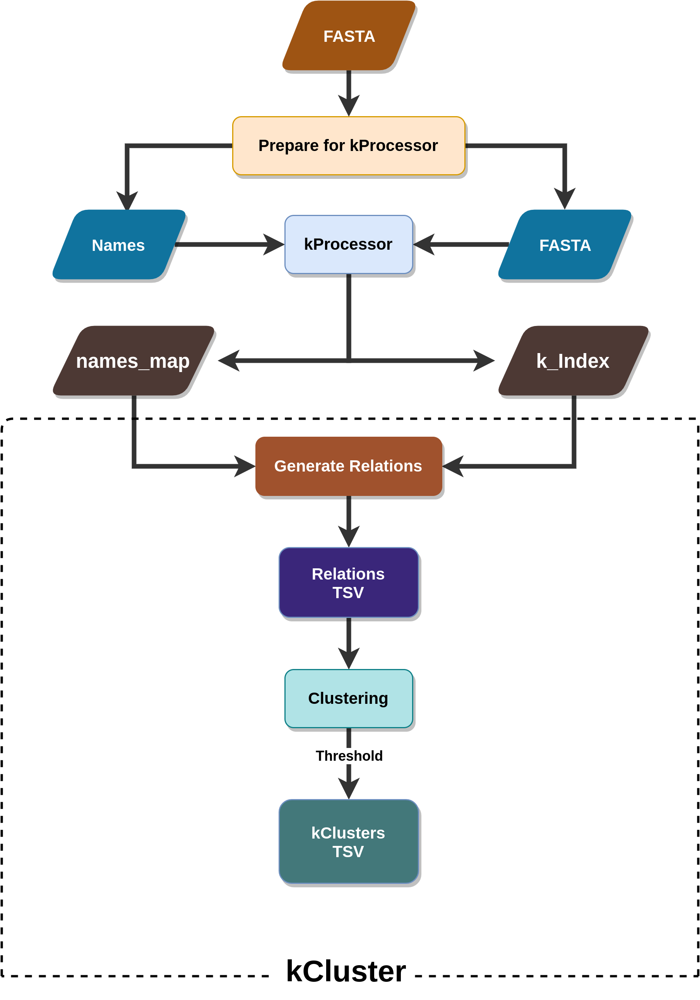

# kCluster



## Clone kCluster

```sh
git clone https://github.com/mr-eyes/kCluster
cd kCluster
```

## Clone kProcessor
```bash
git clone https://github.com/dib-lab/Kprocessor --branch indexFusionGenes --single-branch kprocessor
cd kProcessor
make
cd ..
```

## Reproduce expirement 1 (kCluster Vs. CDHIT Benchmarking)

```bash
bash reproduce_exp1.sh
```

### After it's done (pwd=kCluster/exp1/)

#### Automate CDHIT Benchmarking (Parallel Processing [All Threads])

```bash
bash ../scripts/parallelize_comparison.sh
```

#### Visualize results

```bash
bash ../scripts/visualize.sh
```